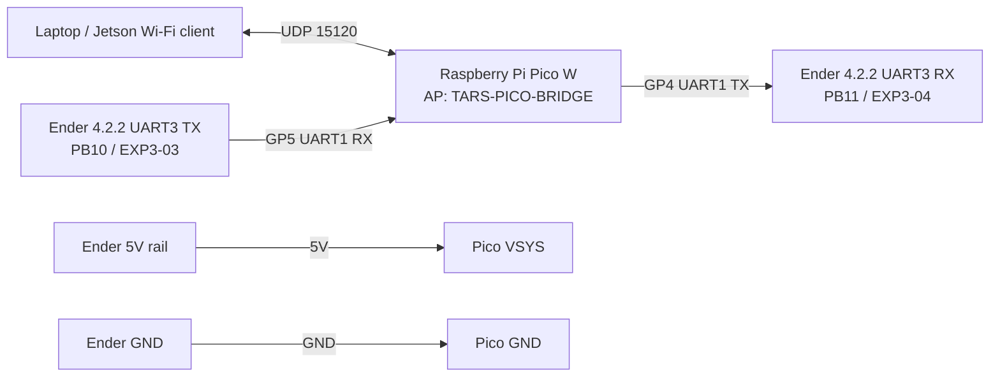

# Pico W To Ender UART Bridge

## Goal

- Validated from repo code: this milestone uses the Pico W as a Wi-Fi UDP bridge and Marlin on the Ender board as the first serial responder.
- Validated from repo code: Marlin maps `UART3_TX_PIN` to `PB10` and `UART3_RX_PIN` to `PB11` on the Creality V4 board family in [`pins_CREALITY_V4.h`](/home/faraday/TARS/firmware/marlin_upstream/Marlin/src/pins/stm32f1/pins_CREALITY_V4.h).
- Validated from repo code: the vendored Marlin config now keeps `SERIAL_PORT 1` on the CH340/USB path and enables `SERIAL_PORT_2 3` for the Pico bridge path in [`Configuration.h`](/home/faraday/TARS/firmware/marlin_upstream/Marlin/Configuration.h).
- Validated from direct hardware inspection: none.
- Inference / engineering judgment: on a 4.2.2 board populated with a GD32 variant, the standard Creality Marlin STM32F103RE build is the closest in-repo build path, but silicon compatibility remains unvalidated until bench testing.

## Firmware Images

- Pico W image source: [`platformio.ini`](/home/faraday/TARS/firmware/pico_leg_controller/platformio.ini) and [`main.cpp`](/home/faraday/TARS/firmware/pico_leg_controller/src/main.cpp)
- Ender image source: vendored Marlin in [`firmware/marlin_upstream`](/home/faraday/TARS/firmware/marlin_upstream)

## Wiring Diagram

## Wiring Notes

- Validated from repo code: `PB10` / `PB11` are the Marlin-defined UART3 pins on the Creality V4 family.
- Inference / engineering judgment: use the EXP3 / LCD-side serial header path associated with those pins.
- Inference / engineering judgment: `GP4 -> PB11` and `GP5 <- PB10` is the expected TX/RX crossover.
- Inference / engineering judgment: the Ender 5V rail can power the Pico W alone for this comms test, but current margin is still unvalidated and servo power should stay off this path for now.
- Do not connect any servo, IMU, or stepper-control wiring for this milestone.

## Bench Test Sequence

1. Build and load the Pico W image.
2. Build and load the Ender Marlin image.
3. Power only the Ender board and Pico W.
4. Join the `TARS-PICO-BRIDGE` Wi-Fi network.
5. Run `python3 tools/udp_bridge_probe.py --host 192.168.4.1 PING` and confirm `PICO:PONG`.
6. Run `python3 tools/udp_bridge_probe.py --host 192.168.4.1 M115` and confirm a Marlin response from the Ender board.

## Expected Result

- `PING` proves wireless communication to the Pico W.
- `M115` proves Pico-to-Ender UART communication in both directions.
- No stepper motion is required or expected in this milestone.
